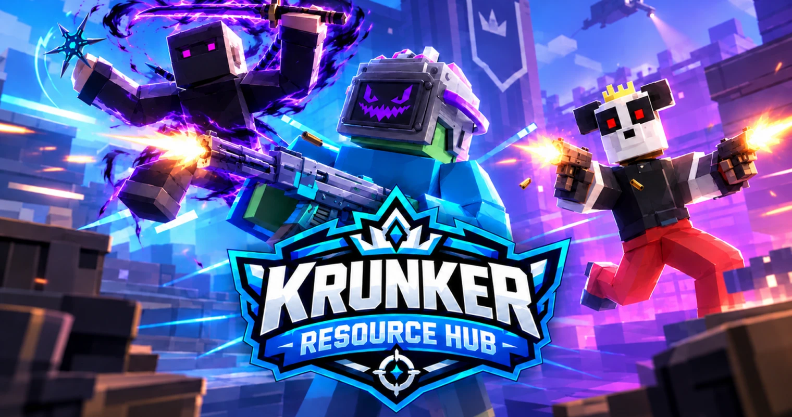

# KRH Client

[](https://github.com/krunkerresourcehub/krh-client/releases)
[](https://github.com/krunkerresourcehub/krh-client/stargazers)
[](https://github.com/krunkerresourcehub/krh-client/releases/latest)
[](https://github.com/krunkerresourcehub/krh-client/blob/main/LICENSE)



KRH Client is the official client of the [Krunker Resource Hub](https://krunker-resources-hub.pages.dev/). It is a high-performance Krunker client that runs on a patched Electron build, and it is based on the [Krunker Civilian Client](https://github.com/bigjakk/krunker-civilian-client) (KCC).

**Download:** [Windows (x64): Setup or Portable](https://github.com/krunkerresourcehub/krh-client/releases/latest) -
[Linux (AppImage)](https://github.com/krunkerresourcehub/krh-client/releases/latest) -
[Build for macOS](#building-from-source)

## How it works

- The client opens on the **Krunker Resource Hub**.
- **Play** launches the game in its own window.
- **Editor**, **Games**, **Viewer**, **Docs** and **Guides** each open in a separate window.
- Closing the game window takes you back to the hub.
- The hub stays open while you play (alt-tab back to it any time). It is frozen while the game has focus, so it uses no CPU or GPU time, and it resumes as soon as you switch to it.

## Features

### Added in KRH Client

- **Gameplay recording** (`F8` to start/stop, `F7` to pause/resume)
  - MP4 (H.264) output, with an automatic WebM fallback if H.264 is not available
  - choose the source: game window only, or the entire screen (other windows included)
  - quality presets (Low / Medium / High) and 30 or 60 FPS
  - audio: game audio, system audio (Windows), or none, with an optional microphone mixed in
  - files are saved to `Videos/KRH Client`
- **Area screenshot** (`Shift+F9`): freeze the game, drag a box over the part you want, and it is copied to the clipboard (the full-window screenshot stays on `F9`)
- **Ranked leaderboard search**: loads the top 1000 players and adds a search box to the leaderboard (works on the social page and in the in-game leaderboard)
- **CPU throttling** (in game and in menus) for systems where the GPU is the bottleneck
- **Cleaner Menu** and **Selectable Chat** options
- **Twitch chat overlay**: read-only chat in-game, no login or API key needed
  - set the channel in Settings > Appearance > Twitch Chat (name or twitch.tv link)
  - Twitch emotes plus BTTV, FrankerFaceZ and 7TV emotes (global and channel sets)
  - channel badges (broadcaster, mod, VIP, subscriber and more) as colored tags
  - **auto placement**: sits on the left in the free space between the top-left HUD (timer, mode info) and the in-game chat, so it covers neither (turn it off in the settings to use your own X / Y)
  - adjustable size, font size and background; `Ctrl+Alt+T` shows or hides it
  - messages **never fade away** (like the in-game chat); the newest 150 are kept, and it always follows the newest message while you play
  - **select and copy**: while the mouse is free (press `Esc`, or in menus / spectating) drag over the messages like text in a browser (blue highlight) and press `Ctrl+C`. It copies as `name: message`, with emotes copied as their names. You can also scroll back through the history with the mouse wheel. While you are aiming the chat stays click-through
  - connects only while the game window is open, so it costs nothing in the hub
- **Twitch `!link` command** (idea from the [LaF Client](https://github.com/LaFClient/LaF)): when a viewer types `!link` in your chat, the client answers `@viewer <link of the game you are in>`
  - turn it on in Settings > Appearance > Twitch Chat (use your **own** channel; the Twitch chat overlay has to be on)
  - sending needs a chat token of your account with the `chat:edit` scope (for example from [twitchtokengenerator.com](https://twitchtokengenerator.com), "Bot Chat Token"). Paste it in the settings; it is stored encrypted on your computer and never shown to the game page
  - answers only while you are really in a match, only while you are live (can be turned off), and at most once every 15 seconds per viewer
- **Built-in LaF themes**: five ready-made CSS themes from the LaF Client (Minimal, Sakura, White Diabodos, NeonStorm, Kartoon) in Settings > Appearance > CSS Theme, no files to copy. They were made in 2021, so parts may not match the current Krunker interface
- **Extras** (Settings > Extras):
  - **Chat filters** (idea from Water Client): type `/players`, `/kills`, `/unbox`, `/server` in the in-game chat to show only that kind of message, `/all` to show everything again; `F3` cycles through them. The command is never sent to the server and hidden messages are only hidden, not deleted
  - **Chat Logs** (idea from PC7 Client): `F1` opens a window with the newest 2000 chat messages; filter by kind, search, select and copy, clickable links. Only the in-game chat is logged
  - **Quick Play grid** (idea from Water Client): `F2` opens a tile picker for regions, gamemodes and maps (the same filters as Settings > Matchmaker) with a Find Match button
  - **Raid finder and Trade Plaza** (idea from Lombre_Blanche): in the Quick Play window (`F2`), join a Soul Sanctum, Khepri, Tortuga, Laboratory, Facility or Bastion raid lobby (least or most players first), the busiest open Trade Plaza (with live player count) or the **ARG** server (`?host=hidden_echo`) with one click. The Quick Play key can be rebound in Settings > Matchmaker
  - **Custom crosshair** (idea from Lombre_Blanche): cross, plus, circle, square, hollow shapes or any symbol, with size, thickness, gap, centre dot, outline and colours. It is drawn once on a static canvas while you aim, so it costs no performance
  - **Auto Find After Disconnect** (idea from Lombre_Blanche, off by default): starts a custom matchmaker search by itself when Krunker shows its update / disconnect screen
  - **No instant re-join**: the custom matchmaker now prefers lobbies you have not just been in (it remembers the last 20)
  - **One-click mod downloader** (idea from Water Client): a download icon on every mod in Krunker's Mods window; the zip is saved to `Downloads/KRH Client/Mods` under the mod's name, never overwriting. Only krunker.io https links are accepted
  - **Ranked badges on the leaderboard**: the normal in-game leaderboard shows each player's ranked badge next to their name (taken from the ranked list once it has been shown)
  - **Settings profiles** (idea from Water Client): save your current in-game Krunker settings under a name and load them again with one click
  - **Display mode** (idea from Water Client): open in Windowed, Maximized or Fullscreen (`F11` still toggles fullscreen)
  - **Userscript hot reload** (idea from Water Client): when a file in your userscripts folder changes, show a notice or reload the page automatically
  - **Hide menu elements** (idea from Water Client): tick which menu parts to hide (Challenges, Leaderboards, Turf Wars, streams panel, terms info, ...). Menu entries are found by their title, so reordering by Krunker does not break it
  - **Discord presence buttons** (idea from Water Client): up to two https link buttons on your Discord status
  - **External resource swapper** (idea from PC7 Client): `externalResourceSwapper.json` in the swapper folder points a Krunker resource at a web link instead of a local file: `{ "/textures/foo.png": "https://example.com/foo.png" }` (https only; the link has to allow cross-origin loading)
  - **Readable logs** (idea from Water Client's Better Console): log lines carry the time with milliseconds and a `MAIN` / `RENDERER` tag (renderer lines need Verbose Logging); coloured when started from a terminal
- **Copy System Info** (Settings > Client): copies your KRH version, OS, CPU, RAM and GPU for bug reports, plus a button that opens the log folder
- **Spotify overlay**: now-playing card (title, artist, progress) in-game, with controls
  - **works with no login and with free accounts**: it reads what is playing on your PC (Spotify desktop app or Spotify in a browser tab) from the system media controls. Windows needs nothing extra; Linux needs `playerctl`
  - live streams (like a Twitch tab) are skipped, and you can list words to ignore. Windows only shows ONE media entry per browser, so if a stream tab is the one playing, pause or close it or use the Spotify desktop app
  - optional: connect your own Spotify developer app to also get album art, see [Spotify setup](#spotify-setup) (Spotify requires a Premium account for that)
  - sits at the top centre of the screen by default
  - `Ctrl+Alt+P` play / pause, `Ctrl+Alt+N` next, `Ctrl+Alt+B` previous, `Ctrl+Alt+S` show / hide; when the mouse is free the card also shows buttons
  - adjustable scale, position, background; can hide itself while nothing plays
  - your login stays on your computer (encrypted with the system keychain when available) and is never visible to the game page; it only polls while the game window is open
- **Quick alt login** (`Ctrl+Alt+1-3`) and a **temporary CSS toggle** (`Ctrl+Shift+F1`)
- **Custom URL blocklist and Chromium flags** through `user_blocklist.json` and `user_flags.json` (Settings > Advanced > Custom Blocklist & Flags)
- **Better performance on NVIDIA systems**
  - Linux: PRIME render offload is enabled automatically on hybrid-graphics laptops when the NVIDIA driver is loaded
  - Windows: KRH Client is registered for the high-performance GPU on hybrid-graphics laptops

### Inherited from KCC

- unlimited FPS with no aim freeze (custom Electron build, see [below](#custom-electron-build))
- unobtrusive: nearly all features can be disabled
- ad hiding
- resource swapper (textures, sounds, models)
- CSS theme system with `@import` support (drop `.css` files in `swap/themes/`)
- separate CSS themes for social/hub tabs (`swap/socialthemes/`)
- custom loading screen backgrounds (`swap/backgrounds/`)
- sky swapper: recolour the in-game sky or replace it with an image (`swap/skies/`)
- customizable matchmaker with lobby scan animation
  - filter by region, gamemode, map, player count, remaining time
  - auto-join with server capacity verification
- external ranked queue (works even when the game is closed)
- rank progress tracker with ELO bar and rank distribution popup
- tabbed social pages with drag-and-drop reorder
- better chat: merged team/all chat with `[T]`/`[M]` prefixes
- chat history preservation
- real-time chat translator (15 languages)
- userscript support (Tampermonkey-style metadata, per-script settings)
- battle pass claim all button
- alt account manager with encrypted credential storage
- Discord Rich Presence (gamemode, map, class, spectator status)
- raw input / unadjusted movement (Windows)
- numeric ping in the player list
- direct server ping option
- hardpoint enemy counter HUD
- keystrokes overlay for streaming
- configurable keybinds with a visual rebinding dialog
- configurable ANGLE backend (D3D11, OpenGL, D3D11on12)
- advanced Chromium flag tweaks (GPU rasterization, high-performance GPU, debloat, and more)

## Hotkeys

The game hotkeys can be rebound in the settings. The tab shortcuts (`Ctrl+T`/`W`/`Tab`/`Shift+Tab`/`1-9`) are fixed.

| Key | Action |
|-----|--------|
| `F4` | New match (triggers the matchmaker if enabled) |
| `F5` | Reload page |
| `F6` | Open matchmaker |
| `F7` | Pause / resume recording |
| `F8` | Start / stop recording |
| `F9` | Screenshot of the game window (copied to the clipboard) |
| `Shift+F9` | Screenshot of a selected area |
| `F11` | Toggle fullscreen |
| `F12` | DevTools |
| `Ctrl+L` | Copy game link |
| `Ctrl+J` | Join game from clipboard |
| `Ctrl+T` | New tab (social) |
| `Ctrl+W` | Close tab |
| `Ctrl+Shift+F1` | Temporarily remove / restore the custom CSS theme |
| `Ctrl+Alt+1-3` | Quick login with the 1st / 2nd / 3rd saved alt account |
| `Ctrl+Alt+T` | Show / hide the Twitch chat overlay |
| `Ctrl+Alt+P` | Spotify play / pause |
| `Ctrl+Alt+N` | Spotify next track |
| `Ctrl+Alt+B` | Spotify previous track |
| `Ctrl+Alt+S` | Show / hide the Spotify overlay |
| `F1` | Chat Logs window (configurable in Settings > Extras) |
| `F2` | Quick Play tile picker (configurable) |
| `F3` | Cycle the chat filter (configurable) |
| `Ctrl+Tab` | Next tab |
| `Ctrl+Shift+Tab` | Previous tab |
| `Ctrl+Shift+T` | Reopen closed tab |
| `Ctrl+1-9` | Jump to tab |

## Spotify setup

**You do not need this for the basic overlay.** Out of the box the card shows whatever is playing on your PC (desktop app or browser tab), with play / pause / next / previous, for free and Premium accounts alike. It has no album art in this mode.

The steps below are only for the optional Web API mode (adds album art). Since February 2026 Spotify only lets **Premium** accounts use the Web API; if it refuses your login, the client quietly falls back to the no-login mode and tells you in the card.

Spotify requires every integration to use its own app registration, so you create one for yourself (free, about two minutes). No client secret is involved.

1. Open the [Spotify Developer Dashboard](https://developer.spotify.com/dashboard), log in and press **Create app**.
2. Any name and description. Under **Redirect URIs** add exactly `http://127.0.0.1:53682/callback` and tick **Web API**.
3. Save, then copy the **Client ID** from the app settings.
4. In KRH Client open Settings > Appearance > Spotify, turn the overlay on, paste the Client ID and press **Connect**. Your browser opens, you approve, and the settings show *Connected*.

Notes:

- Spotify currently requires the owner of a developer app to have **Spotify Premium** (see [Spotify's February 2026 notice](https://developer.spotify.com/documentation/web-api/tutorials/february-2026-migration-guide)); development-mode apps are limited to a handful of users. Playback controls (play / pause / next / previous) need Premium for the account that plays the music. Showing what is playing works with whatever Spotify reports.
- The card shows what plays on any of your Spotify devices (desktop app, phone, web player).
- Port `53682` on your own computer is used only while you press Connect, for the login redirect.
- *Disconnect* in the settings forgets the login. You can also revoke KRH Client at spotify.com/account/apps.

## Recording notes

- Recording works while the game window is open. It stops on its own when the game window is closed, and the file is kept.
- **System Audio** records everything you hear, including Discord voice chat (Windows only). **Game Audio** records only the game.
- Encoding is done in software, so on slower PCs choose 30 FPS or a lower quality if the game starts to stutter.
- Optional environment variables: `KRH_NO_NVIDIA_ENV=1` (Linux) disables the NVIDIA offload variables, and `KRH_NO_GPU_PREFERENCE=1` (Windows) stops KRH Client from registering the high-performance GPU preference.

## Userscripts

Any `.js` file in the scripts folder is loaded as a userscript if userscripts are enabled in the settings. Scripts support Tampermonkey-style metadata blocks (`@name`, `@author`, `@version`, `@desc`) and can define custom settings (boolean, number, select, color, keybind).

> **Use userscripts at your own risk.** Do not write or use userscripts that give you a competitive advantage.

## Custom Electron Build

This client uses a custom-patched Electron build to avoid the aim freeze present in current Electron versions. The patched binary is downloaded automatically during `npm install`.

For details on the patch and on how to build it, see [Electron-Websocket-Fix](https://github.com/bigjakk/Electron-Websocket-Fix).

## Building From Source

1. Install [git](https://git-scm.com/downloads), [Node.js](https://nodejs.org/) and npm
2. Clone and install:
   ```bash
   git clone https://github.com/krunkerresourcehub/krh-client.git
   cd krh-client
   npm install
   ```
3. Run it: `npm start`, or `npm run dev` (development mode with sourcemaps)
4. Package it: `npm run dist:win`, `npm run dist:mac` or `npm run dist:linux`

The macOS build needs a Mac. Without one you can build the DMG on GitHub: open the **Actions** tab, run **Build macOS DMG (unsigned test build)**, and download the DMG from the run's artifacts.

## Feedback

Found a bug or have an idea? [Open an issue](https://github.com/krunkerresourcehub/krh-client/issues).

## Credits

- [Krunker Civilian Client](https://github.com/bigjakk/krunker-civilian-client) by bigjakk: the base of this client
- [Lombre_Blanche's Krunker scripts](https://lombreblanche34.github.io/krunker_scripts/): the ideas of the raid finder, Trade Plaza joiner, ARG shortcut, custom crosshair, auto find after disconnect and avoiding recently joined lobbies, written from scratch for KRH Client
- [PC7 Client](https://github.com/PC7-Client/PC7-Client) (discontinued): the ideas of the Chat Logs window and the external resource swapper, written from scratch. No PC7 code or assets are used (its license does not allow it)
- [Water Client](https://github.com/ghostypostie/Water) by ghostypostie: the ideas of chat filters, Quick Play grid, one-click mod downloader, settings profiles, display mode, userscript hot reload, hide-menu options, Discord buttons and readable logs, all written from scratch for KRH Client
- [LaF Client](https://github.com/LaFClient/LaF) by Hiro527 and sh (MIT license): the idea of the `!link` command and the system info button (both written from scratch for KRH Client), and the five built-in CSS themes, made by NamekujiLSDs, which are included unmodified with their original headers. The MIT license text is in [`assets/laf-themes/LICENSE-LaF.txt`](assets/laf-themes/LICENSE-LaF.txt)
- [Crankshaft](https://github.com/KraXen72/crankshaft) by KraXen72: matchmaker and keystrokes overlay
- [Glorp](https://github.com/slavcp/glorp) by slav: external ranked queue, plus several features reworked for KRH Client (CPU throttling, cleaner menu, selectable chat, custom blocklist and flags)
- [Lombre_Blanche - Krunker Scripts](https://lombreblanche34.github.io/krunker_scripts/): author of the ranked leaderboard userscript that the leaderboard search feature is based on
- [NXT Client](https://github.com/vaqqq/nxt-client) by vaqqq and the NXT team: inspiration for the quick alt login, temporary CSS toggle, Twitch chat and Spotify features. No NXT code is used; NXT is proprietary software and these features were written independently from its public feature list
- [Electron-Websocket-Fix](https://github.com/bigjakk/Electron-Websocket-Fix) by bigjakk: the patched Electron build

## License

KRH Client is released under the [GPL-3.0](LICENSE) license, the same license as the projects it is based on.

KRH Client is an unofficial community project. It is not affiliated with or endorsed by FRVR or Krunker.
